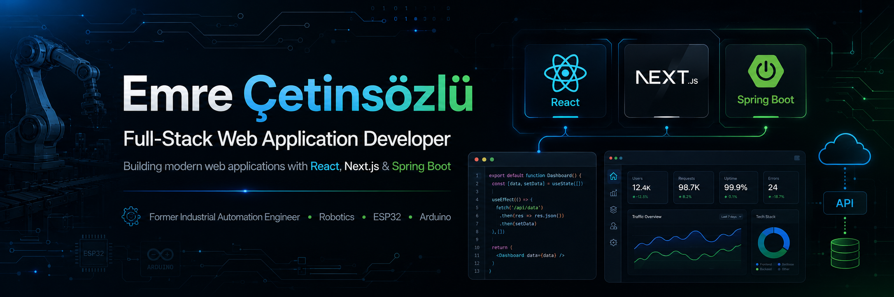

  

<!-- Bu satır GitHub'da görünmez

  

 -->
 
<h1 align="center">
  
</h1>

### A full-stack software engineer passionate about building beautiful, functional, and user-centric web applications.

 

<h2 align="center">🌐 Connect with Me</h2>

  
  &nbsp;&nbsp;
  
  &nbsp;&nbsp;
  
  &nbsp;&nbsp;
  

## 🛠️ Languages and Tools 

 

## 🛠️ Favorite Technologies

### Languages

  

### Frontend

  

### Backend & APIs

  

### Databases & Infrastructure

  

### Robotics, Automation & Computer Vision

  

## ⚡️ Stats

  

  

